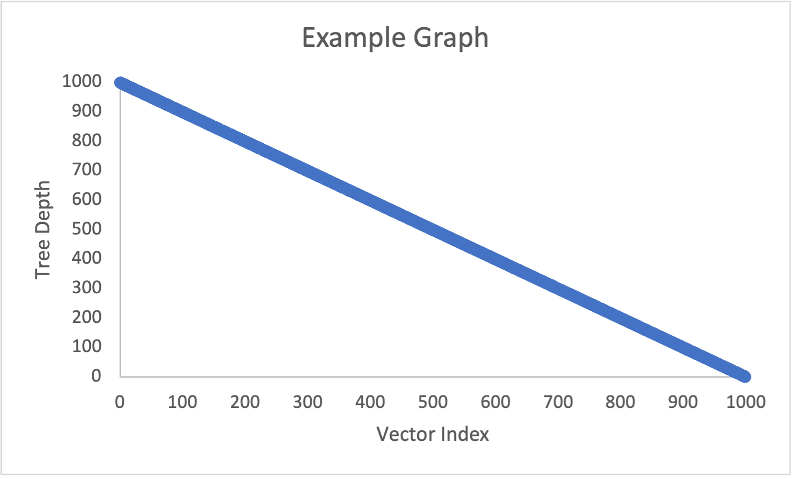

# CS 124 Project 3

Explore Binary Search trees, AVL trees, and Splay trees!

For this project, you will store your 1000+ objects in a Binary Search Tree, an AVL Tree, and a Splay Tree. You will search for objects in the tree and record how many objects you had to visit to complete the search. You will analyze your results from the different data structures.

## Setup
You will want to start at the end of Project 1. You should have a vector of 1000+ objects in your main function.
* You will need to overload the <, >, <=, >=, and == operators of your class from Project 1. Use the unique field to compare objects of your class to ensure that all objects get stored in the trees.

## Requirements

### Tree Classes
Modify the find methods of each tree class (Binary Search Tree, AVL Tree, and Splay Tree) so that a search of the tree also stores the depth of the last node visited. To do this without losing information, pass an integer by reference into both find methods and modify the integer inside the methods.
* The root node is at depth 0.
* Even if the search fails, you should still record the depth of the last node visited.

### Main Function
Create a Binary Search Tree, an AVL Tree, and a Splay Tree all of type integer. Using a loop, insert the integers from 1 to 100 in order. In a second loop, find each integer in order and record the depths to a file in the data folder.
* Check for understanding: print the return values and depths you get from the BST find method if you search for 0, 101, and 102 (you should get 1, 100, and 100, respectively).

Create a Binary Search Tree, an AVL Tree, and a Splay Tree all of type integer. Using a loop, insert the integers from 1 to 100 in a random order. In a second loop, find each integer in order and record the depths to a file in the data folder.
* You can get a random sequence either from random.org or by shuffling a vector of numbers (C++ has a shuffle function).

Create a Binary Search Tree, an AVL Tree, and a Splay Tree all of your custom data type. Using a loop, insert all 1000+ objects into the trees in the order they appear in your vector. In a second loop, find each custom object in the same order and record the depths to a file in the data folder.

Create another Splay Tree of your custom data type. Using a loop, insert all 1000+ objects in the order they appear in your vector. In a second loop, find each object five times in a row before searching for the next object and record the depths to a file in the data folder.
* You should have 5000+ depths stored in the file for this tree.
* You should have a total of 10 tree objects in main.

### Report
You must write a report about your project. Answer the following questions directly in this section of the README file:
* You will have a different grader again, so make sure your report includes information about your dataset.
* How do the depths of the random-ordered integers compare to the depths of the ordered integers for each tree? Why?
* How do the depths of each custom-data-type tree compare to each other?
* Why do the depths of the second custom-data-type Splay Tree make sense?
* Graph the Binary Search Tree, AVL Tree, and Splay Tree depths for the custom data type trees. Do not use C++ to graph, you can use whatever spreadsheet application or graphical programming language you prefer. You can use whatever graph is most readable to you (e.g. scatter plot, histogram, etc.).
  * Your graphs should have clear labels for both x and y axes.
  * Save your graph files in the graphs folder.
  * You do not need to graph the depths of the integer type trees or the Splay Tree that finds each object 5 times in a row, but you can if you feel it helps you analyze the data.
  * An example graph spreadsheet and an example graph image have been included in the starter code.
  * Here is how you include an image in your README.md file: 
* Compare and contrast the graphs and explain the differences based on what you know about the structure and behavior of the trees. Justify the time complexity of searching the trees based on the results.

**Note: Any code that was not authored by yourself or the instructor must be cited in your report. This includes the use of concepts not taught in lecture.**

## Submit
You must include your source files (including the three modified tree header files, your class header file, and the main program file), your data files (including your .csv data file and all of the output depth files), your image files (including all graphs you analyze in your report), CMakeLists.txt, and your updated README.md file that contains your report to your repository. Submit to Gradescope using the GitHub repository link, double-check that all the correct files are there, and wait for the autograder to provide feedback.

## Extra Credit
To earn up to 10 extra credit points (at the grader’s discretion), you can get more thorough results. This can include:
* Setting timers to record how long it takes you to search for the objects in each data structure and analyzing the results
* Performing more experiments with the order of insertions/searches and analyzing the results
* Performing the same experiments on 100, 200, 300, …N objects and graphing the results

Note that if you add this logic to your code but do not analyze it in your report, it will not count towards extra credit. If you choose to complete extra credit, include an analysis in this section of your README.md file.

## Grading
The project is out of 80 points.

| Points Possible | Description of requirement |
|------------------- | ----------------------------- |
| 5 pts | Program compiles and runs. |
| 5 pts | Code style. Readable, naming style is consistent, comments where appropriate. |
| 15 pts | The three BSTs in the main function are complete and correct |
| 15 pts | The three AVL Trees in the main function are complete and correct |
| 20 pts | The four Splay Trees in the main function are complete and correct |
| 20 pts | Report: analysis of results, professional, grammatically correct, cites sources. |
